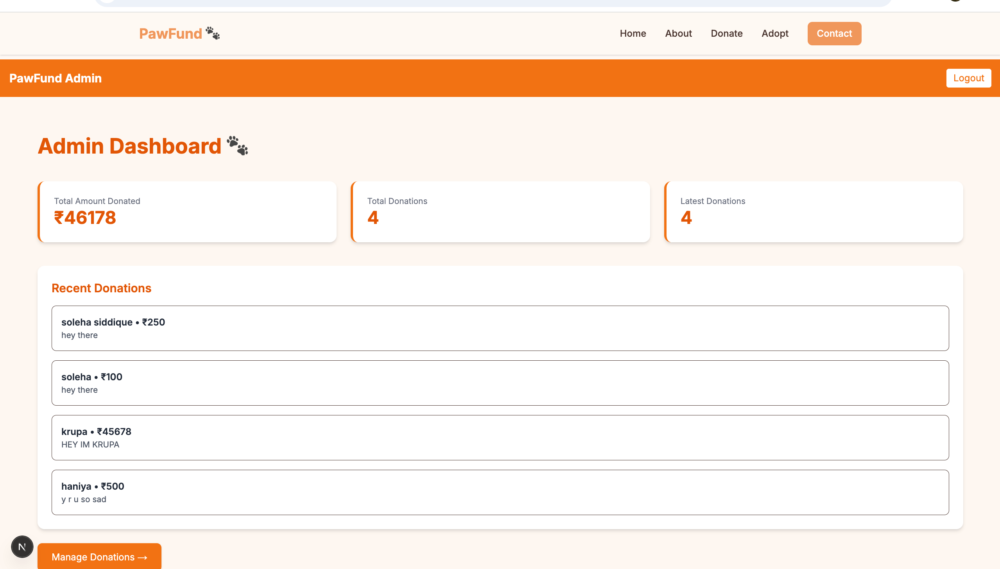
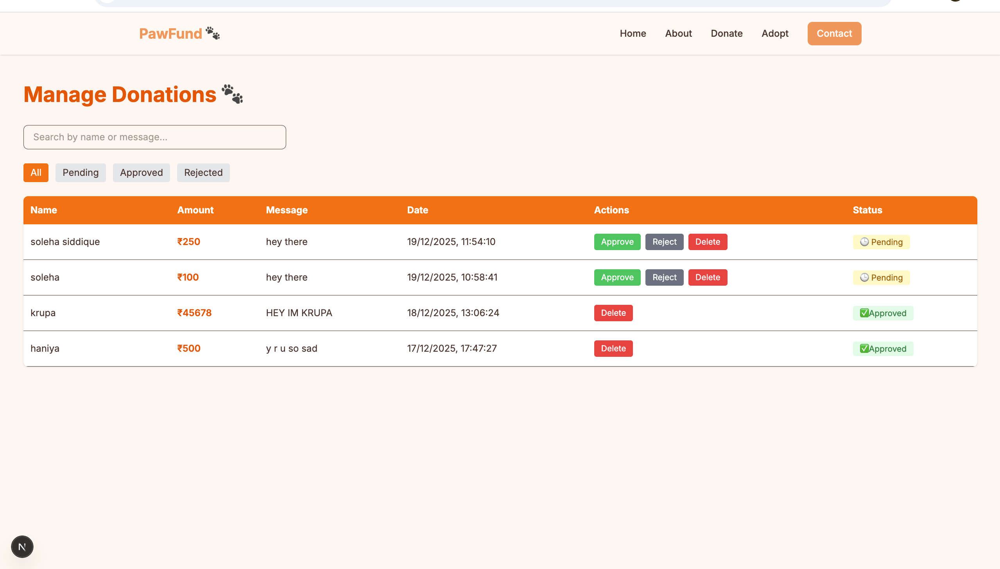

# 🐾 PawFund – Stray Dog Donation & Adoption Platform

PawFund is a full-stack crowdfunding platform built to support stray dogs through donations, awareness campaigns, and adoption initiatives.

The platform allows users to securely donate using Razorpay, explore active campaigns, and learn about rescued dogs through a clean and responsive interface. It also includes an admin dashboard for managing donations and platform activity.

---

## 🚀 Features

- 💳 Secure Razorpay payment integration
- 🐶 Dog adoption showcase page
- 🔐 Admin authentication system
- 📊 Admin dashboard with donation tracking
- ✅ Approve / reject donations
- 🗑️ Delete donation records
- 🛡️ Protected admin routes using middleware
- 📱 Fully responsive UI

---

## 🛠️ Tech Stack

- Next.js 14 (App Router)
- React.js
- MongoDB + Mongoose
- Tailwind CSS
- Razorpay API
- JavaScript

---

## 🌐 Live Demo

🔗 Live Website: https://pawfund-git-working-demo-soleha-siddiques-projects.vercel.app

---

## 📂 Installation

Clone the repository:

```bash
git clone https://github.com/solehasiddique/pawfund.git
cd pawfund
npm install
```

---

## 🔐 Environment Variables

Create a file named `.env` in the root folder and add:

MONGO_URI=your_mongodb_uri

NEXT_PUBLIC_RAZORPAY_KEY=your_public_key
RAZORPAY_KEY_ID=your_key_id
RAZORPAY_KEY_SECRET=your_secret_key
ADMIN_EMAIL=admin@email.com
ADMIN_PASSWORD=your_password

---

## ▶️ Run the Project

npm run dev

Open in browser:
http://localhost:3000

---

## 📸 Screenshots

### Home Page



### Admin Dashboard



## 🎥 Demo


## 🌐 Deployment

This project is deployed on Vercel.

---

## 🧠 Challenges Faced

While building PawFund, I faced several real-world development challenges including:
• Middleware route protection issues
• Admin authentication bugs
• Environment variable configuration problems
• Razorpay deployment/debugging on Vercel
• Branch deployment confusion during production hosting

Solving these issues helped me better understand full-stack deployment and production debugging.

---

## 👩‍💻 Developer

Built with ❤️ by Soleha Siddique

📧 Email: solehasiddique07@gmail.com
🐙 GitHub: https://github.com/solehasiddique
